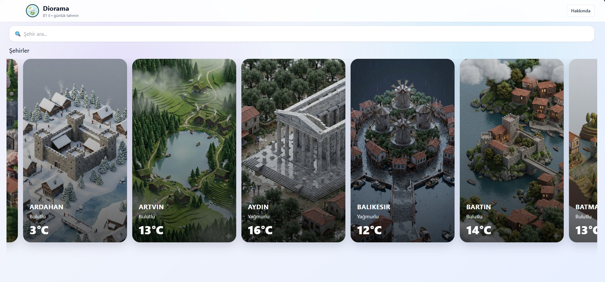
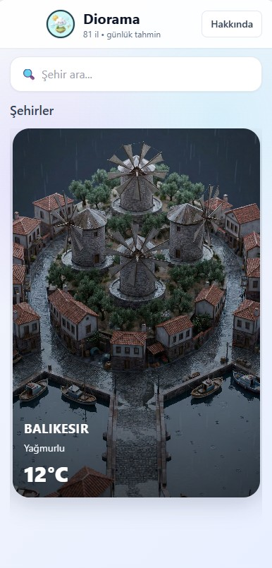

<div align="center">

# ✨ Diorama

<a href="https://mehmetfarukakbulut.github.io/Diorama/">
  
</a>

<br/><br/>

[](https://mehmetfarukakbulut.github.io/Diorama/)


<br/>

**81 ilin atmosferini ekranınıza taşıyan, minimalist hava durumu deneyimi.**
<br/>
*Diorama, karmaşık menüler olmadan Türkiye'nin her noktasındaki havayı estetik "soft" görsellerle sunar.*

</div>

---

### 📸 Ekran Görüntüleri

Projenin **Responsive** yapısı sayesinde ister bilgisayarınızda geniş ekran, ister telefonunuzda dikey formatta kusursuz bir deneyim yaşarsınız.

| 🖥️ Masaüstü Deneyimi | 📱 Mobil Deneyimi |
| :--- | :---: |
|  |  |
| *Geniş ekranda yatay kaydırma ve detaylar* | *Tek elle kullanıma uygun dikey tasarım* |

---

### 🌸 Proje Hakkında

**Diorama**, geleneksel hava durumu uygulamalarının sıkıcı tablolarından uzaklaşarak, kullanıcıya görsel bir deneyim sunmayı hedefler. Tek bir HTML dosyası üzerinde çalışan bu modern web uygulaması, herhangi bir derleme (build) işlemine gerek duymadan tarayıcı üzerinde React gücüyle çalışır.

**Öne Çıkan Özellik:** Uygulama içerisindeki "Diorama" görselleri, hava durumuna (Güneşli, Yağmurlu, Karlı vb.) ve şehre göre dinamik olarak değişerek kullanıcının o anki atmosferi hissetmesini sağlar.

### 🎨 Özellikler

* **⚡ Anlık Veri Akışı:** Open-Meteo API kullanılarak koordinat bazlı (Lat/Lon) gerçek zamanlı hava durumu verisi çekilir.
* **🖱️ Drag-to-Scroll:** Masaüstü ve mobilde kusursuz çalışan, sürükle-bırak mantığıyla gezilebilen yatay şehir listesi.
* **🖼️ Dinamik Görseller:** Şehir ve hava durumu kombinasyonuna göre değişen (Örn: `NanoWeather-Istanbul-Snowy.webp`) özel görsel setleri.
* **✨ Glassmorphism Arayüz:** Tailwind CSS ile oluşturulmuş buzlu cam efektleri ve yumuşak renk geçişleri.
* **📱 Tam Responsive:** Her ekran boyutuna uyum sağlayan esnek kart yapısı.

### 🛠 Teknolojiler

Bu proje, kurulum karmaşasını ortadan kaldırmak için **Standalone** yapıda tasarlanmıştır:

* **Core:** HTML5 & JavaScript (ES6+)
* **Framework:** React 18 & ReactDOM (CDN üzerinden)
* **Compiler:** Babel Standalone (Tarayıcı içi JSX derleme)
* **Styling:** Tailwind CSS (Script tabanlı entegrasyon)
* **Data:** Open-Meteo Free API

### 📂 Proje Yapısı

```bash
Diorama/
├── 📄 index.html          # Tüm React mantığı, stil ve HTML yapısı (Single File)
├── 📁 screenshots/        # README tanıtım görselleri
│   ├── 🖼️ desktop.jpg     # Masaüstü ekran görüntüsü
│   └── 🖼️ mobile.jpg      # Mobil ekran görüntüsü
├── 📁 images/             # Uygulama varlıkları
│   ├── 🖼️ logo.webp       # Uygulama ikonu
│   └── 🖼️ NanoWeather-*.webp  # Şehir/Durum bazlı diorama görselleri
└── 📄 README.md           # Dokümantasyon
